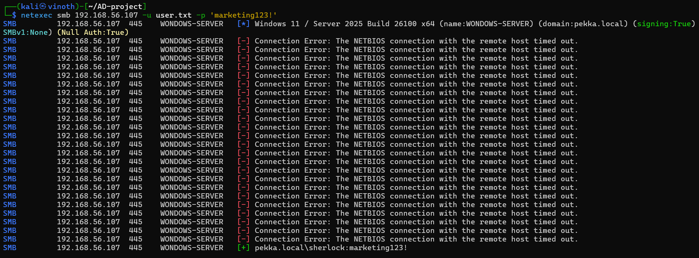
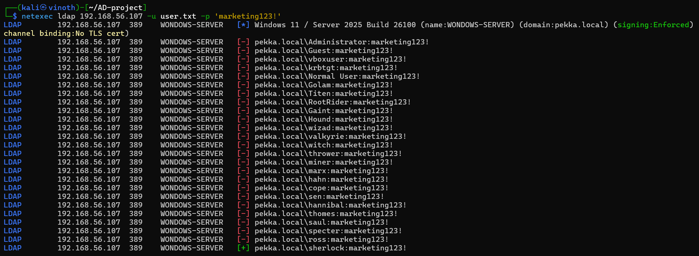
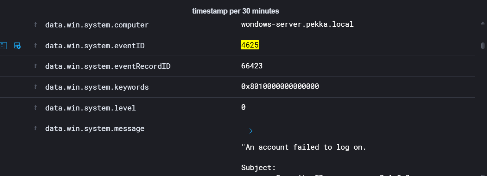

# what is Brut Force
A brute force attack is when an attacker systematically tries many possible passwords or keys until they find the correct one.
# objective 
Demonstrate how Windows records failed and successful authentication attempts during brute force activity, and how Wazuh leverages its built-in rules to detect, correlate, and enrich these events for security monitoring.

# Lab setup 
windows server 
- Active directory domain controller 
windows client 
- Domain joined workstation used to access the shared folder
wazuh manager
- collects windows security logs
kali linux
- Attacking 
Test password
- marketing123!
# Tools used
netexec 
- using one password for all user  
- smb
- LDAP
wazuh
- collect logs
# Attack steps 
Password spraying attack against the SMB and NTLM authentication protocols in our Active Directory lab. A list of valid domain usernames was prepared and stored in a text file, while a single known password was supplied to the password spraying tool.

user test file name :user.txt
password : marketing123!

# windows event IDs
## Event ID 4624
successful logon
Generated when the user successfully authenticates to the SMB service

## Event ID 4625
failed logon 

## Event ID 4634
logoff
# MITRE ATT&CK Mapping
T1110 – Brute Force
### Sub-Techniques:

- **T1110.001 –** **Password Guessing** Attackers attempt to manually or programmatically guess passwords for accounts, often starting with common or weak choices.
    
- **T1110.002 –** **Password Cracking** Offline cracking of password hashes using tools like Hashcat or John the Ripper, leveraging dictionaries or brute force.
    
- **T1110.003 –** **Password Spraying** Attackers try a few common passwords across many accounts to avoid lockouts and detection.
    
- **T1110.004 –** **Credential Stuffing** Using stolen username/password pairs from breaches to attempt access across multiple services.