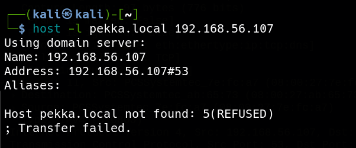
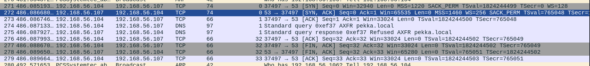
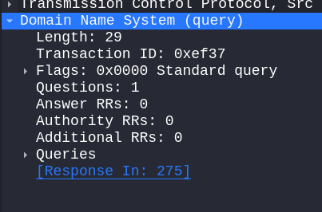
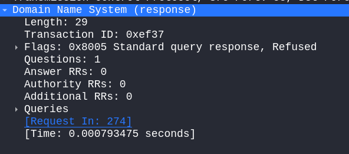

# what is DNS
**DNS (Domain Name System)** is a hierarchical and distributed naming system that maps human‑readable domain names ( example.com ) to machine‑readable IP addresses( 93.184.216.34 ).

# objective 
The objective of this test was to determine whether the DNS server permitted unauthorized DNS Zone Transfer requests. A zone transfer attack was attempted from the attacker machine to verify whether the entire DNS database could be retrieved. The attack failed because Windows DNS Server blocks zone transfer requests by default unless they are explicitly enabled for authorized DNS servers. This test confirms that the default DNS configuration prevents unauthorized zone transfers and protects sensitive DNS records from being disclosed.
# Lab setup 
windows server 
- Active directory domain controller 
Kali
- Executing the attack 
# Tools used
Host 
- Request the zoan transfer 
- 
wireshark
- capture the packet 

# Attack steps 
A DNS Zone Transfer attack attempts to retrieve the complete DNS zone database from an authoritative DNS server. If successful, an attacker can enumerate internal hostnames, IP addresses, mail servers, and other DNS records. In this lab, the attack was performed against the Windows DNS server using the **host** utility. The server refused the zone transfer request because Windows DNS Server disables unauthorized zone transfers by default.

### Step 1

Identify the target DNS server and the target DNS zone.

```
DNS Server : 192.168.56.107DNS Zone   : pekka.local
```

---

### Step 2

Send a DNS Zone Transfer (AXFR) request to the DNS server using the **host** utility.


wireshark packet


### Step 3

The DNS server receives the AXFR request but rejects it because zone transfers are not permitted. The command returns:

```
Host pekka.local not found: 5(REFUSED)Transfer failed.
```

This confirms that the DNS server is reachable, but its security configuration prevents unauthorized clients from downloading the DNS zone database.

---

### Step 4

Capture the network traffic using Wireshark to verify that the AXFR request was transmitted and that the DNS server responded with a **REFUSED** message.



---

# MITRE ATT&CK Mapping

**T1590.001 – Gather Victim Network Information: DNS**  
The attacker attempts to gather DNS information about the target environment. A successful zone transfer would reveal internal DNS records such as hosts, servers, and services.
### Related Techniques

- **T1590 – Gather Victim Network Information** _(Parent Technique)_
- **T1596 – Search Open Technical Databases** _(Attackers may gather DNS information from public sources before targeting internal DNS.)_
- **T1046 – Network Service Discovery** _(DNS reconnaissance is commonly combined with service discovery to map the network.)_