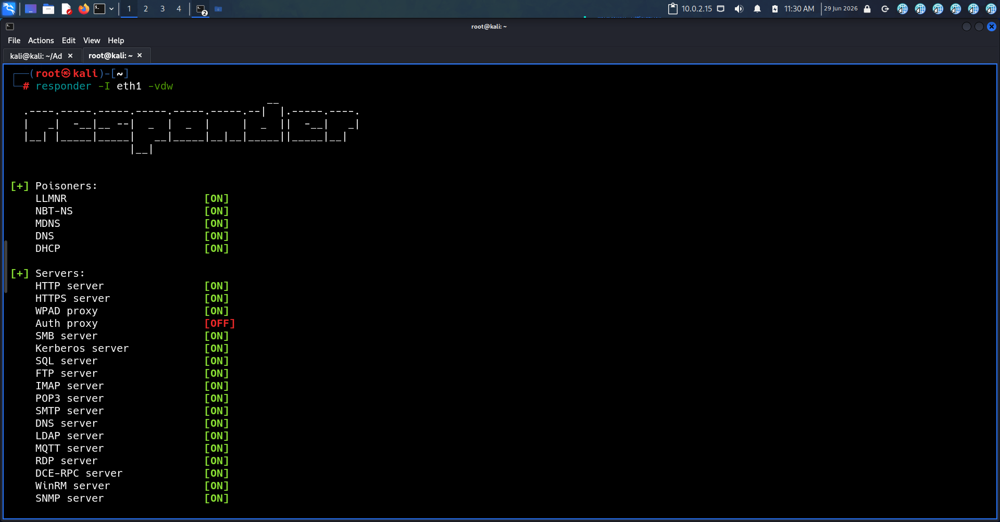
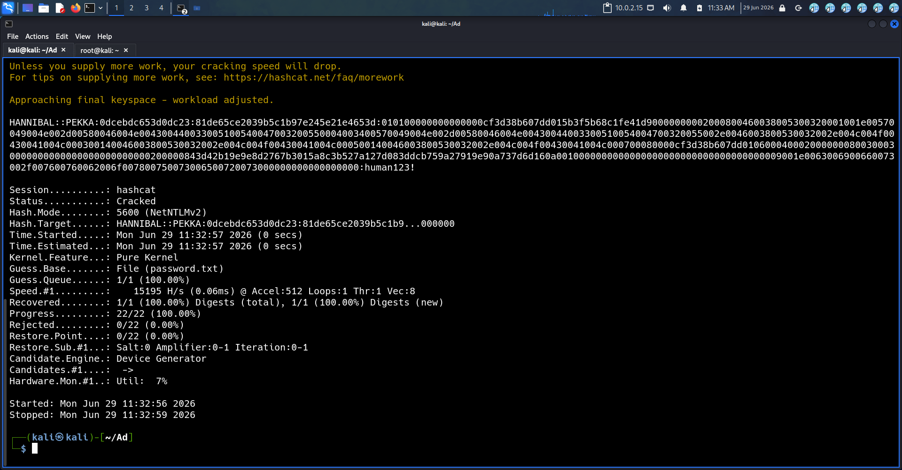
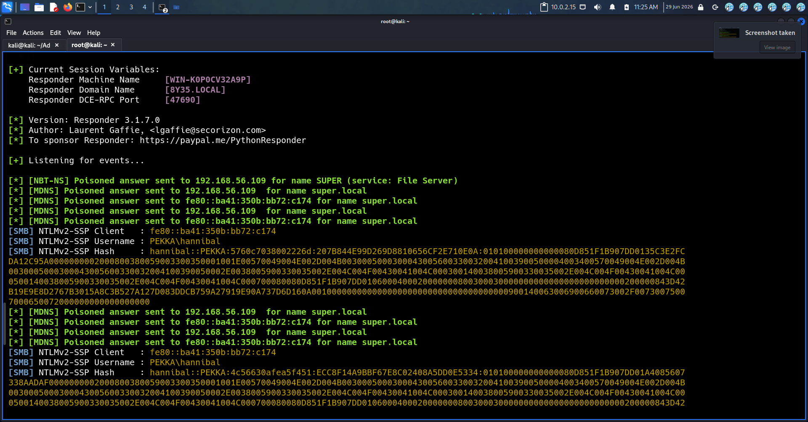

# what is LLMNR
LLMNR stands for Link-Local Multicast Name Resolution. It's a protocol that allows devices on the same local network to resolve names to IP addresses without needing a DNS server. This is particularly useful in environments where DNS might not be available, helping to simplify the process of connecting to other devices
# objective
Demonstrate how vulnerable LLMNR when the attacker have the local network access

# Lab setup 
windows server 
- Active directory domain controller 
windows client 
- Domain joined workstation used to access the files
kali linux
- Executing the attack 
# Tools used
Responder
- - Capture the board cast form windows server 
Hashcat
- crack that password hash form the board cast 

# weakness in name resolution 

• LLMNR is enabled by default on Windows systems
• It activates when DNS resolution fails
• The protocol allows any device on the network to respond to queries
• LLMNR messages are not encrypted during transmission
• The protocol does not verify the authenticity of responses
• Any device on the network can send responses to LLMNR queries
# Attack steps 
LLMNR enhances connectivity in local networks by allowing devices to communicate without a central DNS. It aims to increase convenience, enabling attackers to respond to name resolution requests with misleading information.
## step 1
	Attacker listen for LLMNR board cast 
# step 2 
	 when host need IP for a name attacker replay to the request 

## step 3
	 Host will connect to the attacker respond, attacker will use the hash to crack the password 

d# MITRE ATT&CK Mapping
T1557.001 – LLMNR/NBT-NS Poisoning
### Related Technique
T1557 – Adversary-in-the-Middle (parent technique) **T1040 – Network Sniffing** (often used together for credential capture) **T1110.001 – Password Guessing** (credentials harvested via LLMNR can be brute-forced offline)