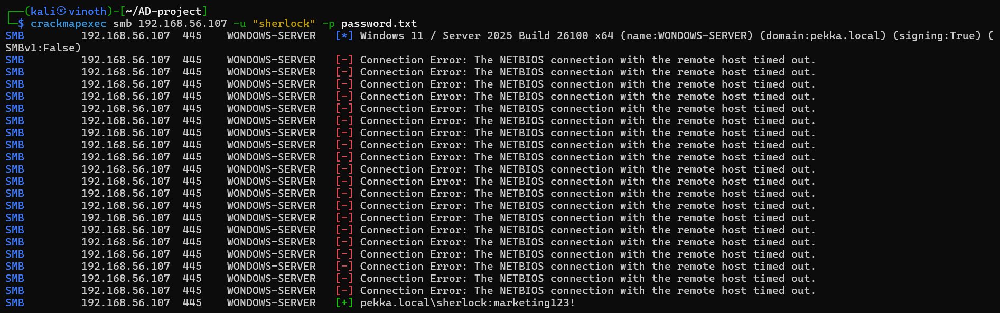

# objective 
Demonstrate how Windows records SMB share access events and how Wazuh detects and enriches these events using custom detection rules.

# Lab setup 
windows server 
- Active directory domain controller and SMB file server
windows client 
- Domain joined workstation used to access the shared folder
wazuh manager
- collects windows security logs
SMB service 
- file sharing protocol 
Test User
- sherlock 

# Tools used
crackmapexec 
- Verify SMB authentication using domain credentials.

smbclient 
- accessing the shard folder 
![[Accessing the shard folder.png]]
wazuh
- collect logs 

# Attack steps 
This demonstration simulates a legitimate user accessing a shared folder hosted on the Windows Server through the SMB protocol.

Although this activity is not malicious, monitoring SMB access is important because attackers frequently use SMB for:

- Lateral Movement
- File Discovery
- Data Collection
- Data Exfiltration

The objective is to verify that Windows generates the appropriate Security Events and that Wazuh successfully detects the activity.
## Attack steps 
### step 1
connect to the smb share 
  smbclient //192.168.xx.xx/Share -U sherlock
### step 2
 Authenticate using valid domain credentials.
### step 3
 Browse or access files within the shared folder
### step 4
Disconnect from the SMB session.

# windows event IDs
## Event ID 4624
successful logon
Generated when the user successfully authenticates to the SMB service
![[account-logon.png]]
## Event ID 5140
Network Share Access
Generated when the user accesses a shared folder on the server.
This is the primary event used for detecting SMB share access.
![[shard-object-accessed.png]]
## Event ID 4634
logoff
![[smb-logoff.png]]

# wazuh custom rule
# Event ID 4624
 A custom Wazuh rule was created to detect successful SMB share access by monitoring Windows Event ID 4624. The rule extracts important fields such as the username and generates a readable alert for security monitoring ![[custom-rule-4624.png]]
Detection Result ![[4624-rule-works.png]]

## Event ID 5140
A custom Wazuh rule was created to detect successful SMB share file access by monitoring Windows Event ID 5140. The rule extracts important fields such as the username, share name and ip address for security monitoring
![[custom-rule-5140.png]]
Detection Result 
![[5140-rule-works.png]]

## why detection matter
SMB is one of the most commonly abused protocols in Windows environments. Attackers often use SMB during lateral movement, credential theft, and data collection. Monitoring successful SMB access helps defenders identify unusual user behavior, unauthorized file access, and potential compromise.

# MITRE ATT&CK Mapping
Technique:  
T1039 – Data from Network Shared Drive  
  
Related Technique:  
T1021.002 – SMB/Windows Admin Shares
# Overall
Objective → Environment → Attack → Windows Events → Wazuh Rule → Alert → MITRE Mapping → Defensive Recommendations

# Conclusion
This demonstration shows how legitimate SMB authentication and network share access generate Windows Security Events that can be collected and analyzed by Wazuh. By creating custom detection rules for Event IDs 4624 and 5140, defenders gain greater visibility into user activity on network shares, helping identify unauthorized access and supporting investigations into potential lateral movement.
