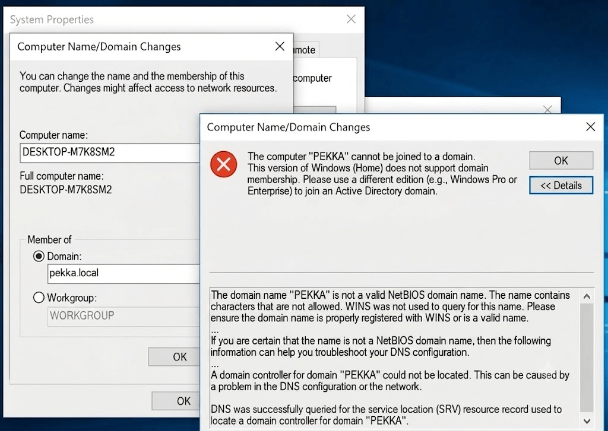
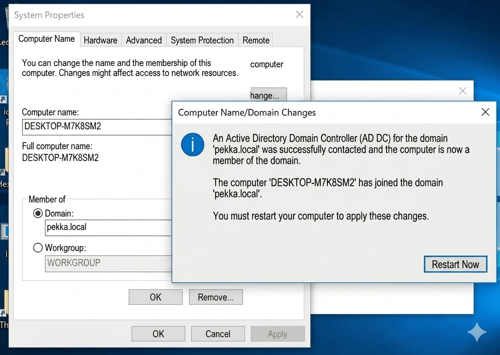

# Overview
This lab was built to simulate a Windows Active Directory enterprise environment for learning Active Directory administration, attack simulation, and security monitoring using Wazuh.

# Software 
| Software       | Version |
| -------------- | ------- |
| Virtual box    | 7.2.2   |
| Windows Server | 2025    |
| Windows        | 10      |
| Kali Linux     | 2026.2  |
| wazuh          | 4.14.3  |

# Virtual Machines
| Machine | Purpose           |
| ------- | ----------------- |
| DC01    | Domain Controller |
| WIN10   | Domain Client     |
| KALI    | Attack Machine    |
| wazuh   | Log collector     |
## Resource Allocation
| VM    | CPU |    RAM |  Disk |
| ----- | --: | -----: | ----: |
| DC01  |   4 |   4 GB | 80 GB |
| WIN10 |   2 | 2.5 GB | 40 GB |
| KALI  |   2 |   4 GB | 40 GB |
| wazuh |   2 |      3 | 20 GB |
# Network Configuration
```text 
Diagram
       +----------------+
       | VMware Network |
	   +----------------+
      |     |      |      |
    DC01  WIN10  Kali   wazuh

```
192.168.x.x

- Network Mode: NAT  
- Domain Controller: Static IP  
- Client: DHCP  
- Kali: DHCP
- wazuh: Static IP

# windows Edition Upgrade (client)
Before joining the client machine to the Active Directory domain, I discovered that the virtual machine was running **Windows 10 Home**. This edition does not support joining an Active Directory domain because Microsoft does not include the Domain Join feature in the Home edition. To continue building the lab, I upgraded the operating system to **Windows 10 Pro** using a valid license. After the upgrade was completed, the machine was successfully joined to the `pekka.local` domain

Windows 10 Home  

↓  

Domain Join Attempt

↓  

Feature Not Supported  

↓  
  
Upgrade to Windows 10 Pro  
microsoft generic key to upgrade   
W269N-WFGWX-YVC9B-4J6C9-T83GX -->do it offline   

↓  

Restart  

↓

Join pekka.local Domain  


# Installing AD DS in windows server
Install AD DS role    
```powershell
Installing AD
`Install-WindowsFeature -Name AD-Domain-Services`
output
Success Restart Needed Exit Code Feature Result 
------- -------------- --------- -------------- 
True No Success {Active Directory Domain Services, Remote ...
```
↓

Install-windowsFeature

↓

Install-ADDSForest  
```powershell
command
Install-ADDSForest `
-DomainName "pekka.local"

#output  
WARNING: A delegation for this DNS server cannot be created...

Success Restart Needed Exit Code Feature Result
------- -------------- --------- ------------------------------
True    No             Success   {Active Directory Domain Services}

WARNING: The server is now being restarted...
```

↓

Automatic Restart 

↓

Promote to Domain Controller  
```powershell
command 
Install-ADDSForest `
-DomainName "pekka.local"
```

```powershell
output
SafeModePassword: ************
ConfirmSafeModePassword: ************

Target Server: LOCALHOST

WARNING: Windows Server 2025 domain controllers have a default security setting for 'Cryptography settings' that prevents older clients from connecting. Ensure all client machines meet the updated security standards or adjust the policy as needed.
WARNING: A delegation for this DNS server cannot be created because the authoritative parent zone cannot be found or it does not run Windows DNS server. If you are integrating with an existing DNS infrastructure, you should manually create a delegation to this DNS server in the parent zone to ensure reliable name resolution from outside the domain "pekka.local". Otherwise, no action is required.

Success Restart Needed Exit Code Feature Result
------- -------------- --------- --------------
True    No             Success   {Active Directory Domain Services}


WARNING: The server is now being restarted because Active Directory Domain Services has been installed or removed.
```

# Installing wazuh agent 

Download wazuh  
```powershell
#Powershell Command 
Invoke-WebRequest -Uri "https://packages.wazuh.com/4.x/windows/wazuh-agent-4.9.2-1.msi" -OutFile "$env:USERPROFILE\Downloads\wazuh-agent.msi"
```
>change you wazuh version

↓

Install and Pass Configuration Variables  
**Power shell command**
```powershell
Start-Process msiexec.exe -ArgumentList "/i "$env:USERPROFILE\Downloads\wazuh-agent.msi" /q WAZUH_MANAGER="192.168.1.100"" -Wait ```
```
> Replace the wazuh manager IP with the IP assigned to you wazuh manager 

↓

Check the configuration   
```text
#Path to the file
C:\Program Files (x86)\ossec-agent\ossec.conf

<ossec_config>

  `<client>`
    `<server>`
      `<address>192.168.56.106</address>`
      `<port>1514</port>`
      `<protocol>tcp</protocol>`
    `</server>`
<-- check the IP is your wazuh manager IP -->
```


↓

```powershell
#Start the Wazuh Service  
#Set the service to automatic startup
Set-Service -Name "Wazuh" -StartupType Automatic

#Start the service  
Start-Service -Name "Wazuh"

#verity the connection
Get-Content "C:\Program Files (x86)\ossec-agent\ossec.log" -Tail 20
#Read the last few line of local log file
```
# Installing Sysmon 

Download Sysmon

**Purpose**
Sysmon was installed on the Windows endpoint to provide detailed telemetry, such as process creation, network connections, and file creation events. These logs were forwarded to Wazuh for detection and analysis.

↓

Install Sysmon
```powershell
#Download the Sysmon ZIP file
Invoke-WebRequest -Uri "https://download.sysinternals.com/files/Sysmon.zip" -OutFile "$env:USERPROFILE\Downloads\Sysmon.zip"

#Extract the contents to**
C:\Sysmon Expand-Archive -Path "$env:USERPROFILE\Downloads\Sysmon.zip" -DestinationPath "C:\Sysmon" -Force

#Navigate to the extracted folder**
cd C:\Sysmon
```

↓

```powershell
#Installation
.\Sysmon64.exe -accepteula -i
```
↓

```powershell
#Verify Sysmon Service
Get-Service -Name "Sysmon64"
```

```powershell
#Output
PS C:\Users\vboxuser> Get-Service -Name "Sysmon64"

Status   Name               DisplayName
------   ----               -----------
Running  Sysmon64           Sysmon64

```
↓

```text
Configure Wazuh Agent (ossec.conf)
File path C:\Program Files (x86)\ossec-agent\ossec.conf

**Add this line in the end**
`<!-- sysmom log collection -->`
`<localfile>`
  `<location>Microsoft-Windows-Sysmon/Operational</location>`
   `<log_format>eventchannel</log_format>`
 `</localfile>`
```

↓

```powershell
#Restart Wazuh Agent
Restart-Service Wazuh
```

↓

Sysmon Events → Wazuh Manager

# kali linux configuration 

The Kali Linux virtual machine is configured with **two network adapters** to separate Internet access from the internal lab network.
### Network Configuration

|Adapter|Network Mode|Purpose|
|---|---|---|
|Adapter 1|NAT _(or Bridged)_|Internet access for installing tools, downloading updates, and package management.|
|Adapter 2|Host-Only|Communication with the Domain Controller and Windows client during attack simulations.|
## Why Two Network Adapters?

Using two network adapters keeps the lab environment organized and flexible:

- The **NAT (or Bridged)** adapter provides Internet connectivity when tools or system updates are required.
- The **Host-Only** adapter creates an isolated lab network, allowing Kali to communicate directly with the Domain Controller and Windows client without exposing the lab to the local network.

This configuration provides a stable environment for reconnaissance, enumeration, exploitation, and detection exercises while maintaining convenient Internet access when needed.
# Verification

✔ Domain Controller reachable.  
  
✔ Client joined to domain.  
  
✔ Kali can communicate with lab network.  
  
✔ Wazuh agent connected.  

✔Installing sysmon log collector 
  
✔ Domain users can authenticate.